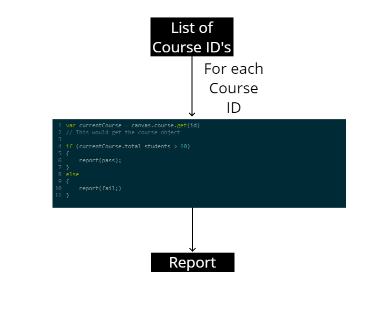

# Key Components Doc for There are no courses that have low student count 
#### *Author: Cameron Thompson, Jacob Schwantes*
#### *Date: 7/15/2019*

# Preliminary Design

## Magic Box Chart

<!-- Think through the process as much as makes sense, and then create a magic box chart with the whiteboard and place it here. -->

## Explanation of Design
<!-- Add explanation of the Magic Boxes image above. Answers to the prompts below may also be appropriate to include here. -->
This audit takes a list of course ID's. Then for each course ID the audit will call `/api/v1/courses/:course_id/users?enrollment_type[]=student` to get a list of students. There will be some threshhold variables that will be set to determine what "low student count" is (10-) and what "high student count" is (50+), and they will be easy to access and change. Conditional logic will throw a fail if the number of students is lower than the threshold, and also warn if it is higher than the warning threshold for high student count. 

### Used Libraries
<!--
## Things to Consider Before Getting Project Approved
- Are there any approved libraries that I can use? [Link to Approved Library List]
- Are there design patterns that will help?  [Link to Design Patterns]
- Can I design it so that it is a general tool instead of a specific solution?
- How can it be easily expanded?
- What does the minimum viable product look like?
## Prep for Learning Phase
- What do I need to learn
- How will I learn it
- What will I do to learn it (prototypes/tutorials/research time limit?)
- What is the definition of done for my learning process
- How do I measure the progress of learning
- Is there a deliverable that can be created during the learning process?
-->
-----

#### *Preliminary Design Approved By:* 
#### *Preliminary Design Approval Date:*

# Full Design

## Component Diagrams
<!-- Diagrams and companion explanations for all Key Components.
These would include information about inputs, outputs, and what a function does for every major function. -->

<!-- For each component, the following template will be followed: (In other words, the template below will repeat for each component)-->

### *Insert Component name here*

Diagram:

*Insert Diagram Here*

Explanation:

*Insert Explanation here*

<!-- For a future release:
## Test Plans
For each major function the test plan template will be as follows (in other words the template below will repeat for each test) 
### *Insert name of component here (e.g. convertIdToCourseObject function)*
#### Test 1: *Insert Test name here*
Summary: 
 *Insert Test Summary Here*
 Type: *Insert Type here (Unit Test, Manual Test, Selenium/Puppeteer test (Overkill?))* 
Procedure:
1. *Insert Steps here*
1. *and here*
1. *and here*
Expected Outcome:
*Insert Expected Outcome here*
-->

## Test Plans

### *Insert Module Name Here*
#### How to Test:

-----

#### *Full Design Approved By:* 
#### *Full Design Approval Date:*

<!-- Diagram Types:
 - Data Flow (I think this will be the most popular)
 - Structure Charts (This is really good for showing input and output of every function)
 - UML Class Diagram (a must for object oriented projects) -->

