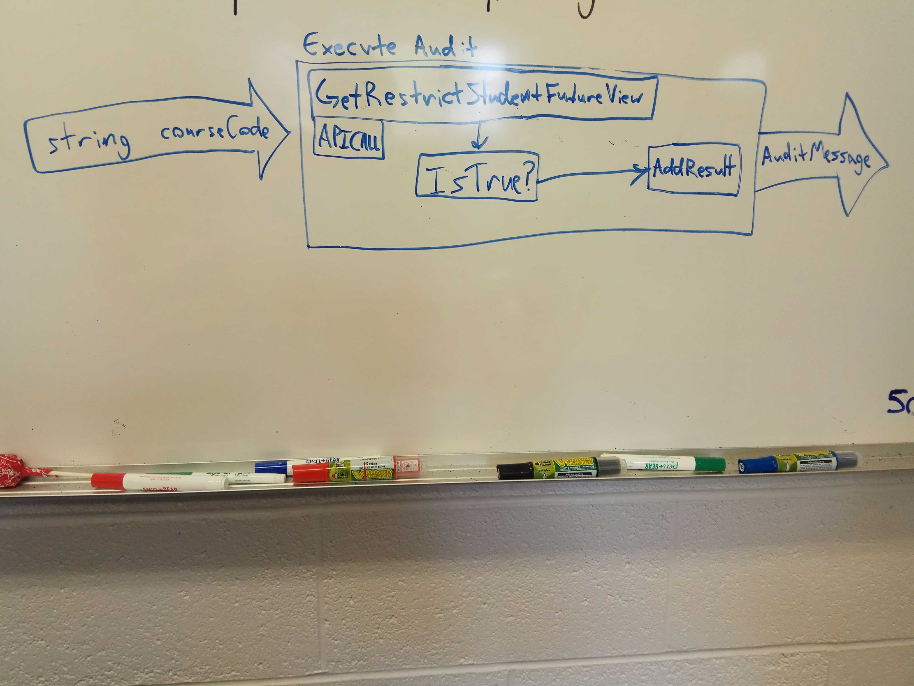

# Key Components Doc for Availability After Start Date Audit
#### *Author: Kaylee Hartzog*
#### *Date: 2019 July 15, 12:57*

# Preliminary Design

## Magic Box Chart

<!-- Think through the process as much as makes sense, and then create a magic box chart with the whiteboard and place it here. -->

## Explanation of Design
This audit will test the workflow_state of a given course. The audit is passed a List of strings called CourseCodes. For each of the course codes in the list, the audit does an HTTP Request in order to get the JSON for the Course using the endpoint: `/courses/:course_id/settings`. Using the JSON, it will take the value that the course has for workflow_state: `/workflow_state`. If the workflow_state is set to available, then the audit passes. If the workflow_state is set to unpublished, then the audit will fail. The result of the audit will be passed into a list of audit results. Once all of the course codes have been processed, the audit will return that list of audit results.

### Used Libraries

<!-- ## Things to Consider Before Getting Project Approved
- Are there any approved libraries that I can use? [Link to Approved Library List]
- Are there design patterns that will help?  [Link to Design Patterns]
- Can I design it so that it is a general tool instead of a specific solution?
- How can it be easily expanded?
- What does the minimum viable product look like?

## Prep for Learning Phase
- What do I need to learn
- How will I learn it
- What will I do to learn it (prototypes/tutorials/research time limit?)
- What is the definition of done for my learning process
- How do I measure the progress of learning
- Is there a deliverable that can be created during the learning process? -->
