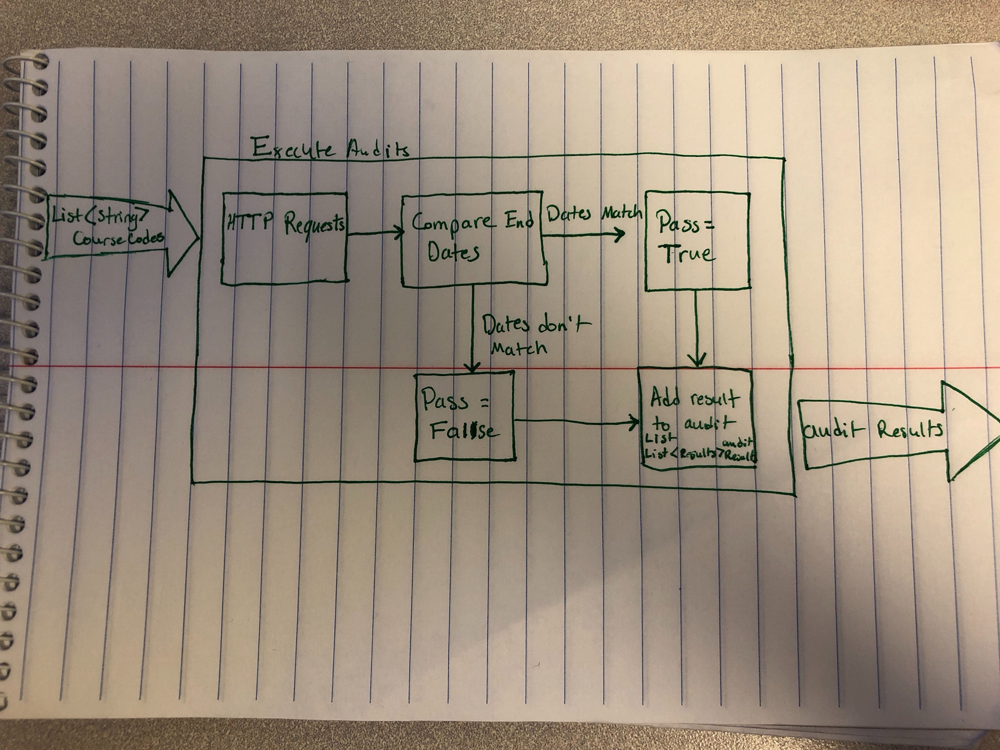

# Key Components Doc for End Date Audit
#### *Author: Kaylee Hartzog*
#### *Date: 2019 July 12, 13:01*

# Preliminary Design

## Magic Box Chart

## Explanation of Design
This audit will test the end date of a given course. For each course code, we will make an API call to: `/api/v1/courses/course_id` to get the course and test the `end_date` property of that course. Using the JSON, it will take the value that the course has for end date, and compare it to the correct end date. If the dates for the end dates match, then the audit passes. If the dates for the end dates don't match, then the audit will fail. The result of the audit will be passed into a list of audit results. Once all of the course codes have been processed, the audit will return that list of audit results.

### Used Libraries
<!-->
## Things to Consider Before Getting Project Approved
- Are there any approved libraries that I can use? [Link to Approved Library List]
- Are there design patterns that will help?  [Link to Design Patterns]
- Can I design it so that it is a general tool instead of a specific solution?
- How can it be easily expanded?
- What does the minimum viable product look like?

## Prep for Learning Phase
- What do I need to learn: 

Where to find the information for the correct date without having to hard code it.
- How will I learn it

Ask Corey maybe.
- What will I do to learn it (prototypes/tutorials/research time limit?)
- What is the definition of done for my learning process
- How do I measure the progress of learning
- Is there a deliverable that can be created during the learning process?
-->
-----

#### *Preliminary Design Approved By: Jake Schwantes* 
#### *Preliminary Design Approval Date: 31 July 2019*

# Full Design

## Component Diagrams
<!-- Diagrams and companion explanations for all Key Components.
These would include information about inputs, outputs, and what a function does for every major function. -->

<!-- For each component, the following template will be followed: (In other words, the template below will repeat for each component)-->

### *Insert Component name here*

Diagram:

*Insert Diagram Here*

Explanation:

*Insert Explanation here*

<!-- For a future release:
## Test Plans
For each major function the test plan template will be as follows (in other words the template below will repeat for each test) 
### *Insert name of component here (e.g. convertIdToCourseObject function)*
#### Test 1: *Insert Test name here*
Summary: 
 *Insert Test Summary Here*
 Type: *Insert Type here (Unit Test, Manual Test, Selenium/Puppeteer test (Overkill?))* 
Procedure:
1. *Insert Steps here*
1. *and here*
1. *and here*
Expected Outcome:
*Insert Expected Outcome here*
-->

## Test Plans

### *Insert Module Name Here*
#### How to Test:

-----

#### *Full Design Approved By:* 
#### *Full Design Approval Date:*

<!-- Diagram Types:
 - Data Flow (I think this will be the most popular)
 - Structure Charts (This is really good for showing input and output of every function)
 - UML Class Diagram (a must for object oriented projects) -->