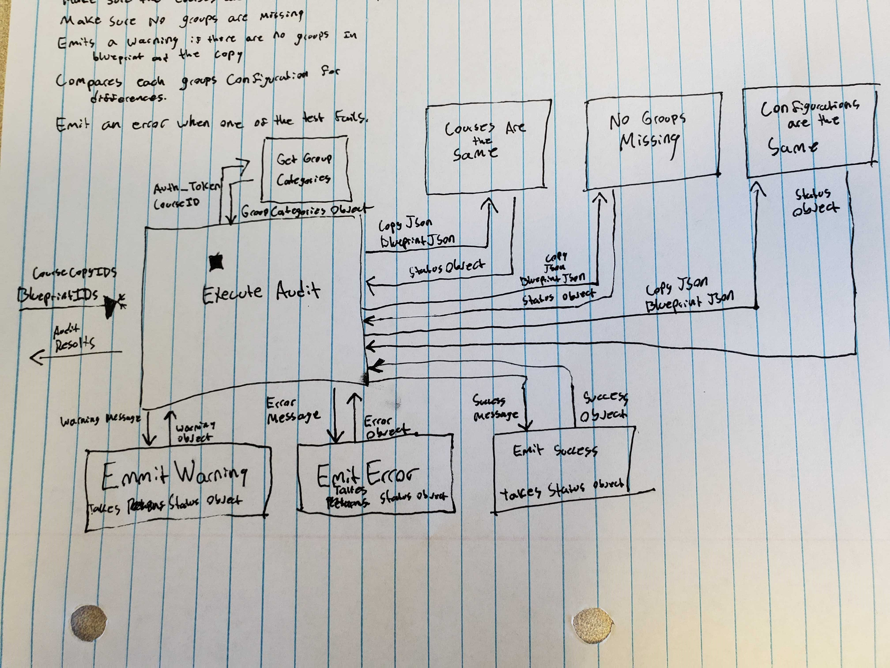

# Key Components Doc for Group Categories Audit
#### *Author: Eric Julander*
#### *Date: July 10th, 2019*

# Preliminary Design

## Magic Box Chart

<!-- Think through the process as much as makes sense, and then create a magic box chart with the whiteboard and place it here. -->

## Explanation of Design
<!-- Add explanation of the Magic Boxes image above. Answers to the prompts below may also be appropriate to include here. -->
Here is the general flow of the Audit:
### Objects:
#### GroupCategory:
This holds the same structure as the Canvas Group Categories Object.
https://canvas.instructure.com/doc/api/group_categories.html
#### Status Object
- *Status* - Contains a value describing the success of the operation ( 0 = pass, 1 = warning, 2 = failure)
- *Message* - The message accompanying the status of the operation.

### Methods:
#### GetFileList
This grabs a GroupCategory object from the canvas API.

##### Parameters: 

- *AuthToken*: The API Token for canvas. 
- *OrgId*: The org unit id for the course.

##### Outputs:

- *GroupCategory*: A POCO which holds the data of a Canvas Group Category Object.

#### CoursesMatch (Courses are the Same)
This checks wethere the two courses are the same. If the courses are completley different, it will emit a "Mismatched Course Failure" though a status object. If the courses are the same it will emit a "success" through the status object.

##### Parameters: 

- *BlueprintCourse*: GroupCategoryObject for the blueprint course. 
- *CopiedCourse*: GroupCategoryObject for the copied course.

##### Outputs:

- *StatusObject*: The status of the preformed operation (pass, warning, failure)

#### GroupsMatch (No Groups Missing)
This checks that both the blueprint and the copied courses have matching group categories. If the categories are not matching, it will emit a "Missing Group Failure" though the status object. If neither the blueprint or the course copy have group categories, it will emit a "No Group Categories Warning" through the status object. If the courses have matching group categories, it will emit a success through the status object.

##### Parameters: 

- *BlueprintCourse*: GroupCategoryObject for the blueprint course. 
- *CopiedCourse*: GroupCategoryObject for the copied course.

##### Outputs:

- *StatusObject*: The status of the preformed operation (pass, warning, failure)

#### ConfigurationsMatch (Configurations are the Same)
This checks that both the blueprint and the copied courses have matching group category configurations. If the configurations are not matching, it will emit a "Mismached Configuration Failure" though the status object. If the courses have matching group category configurations, it will emit a success through the status object.

##### Parameters: 

- *BlueprintCourse*: GroupCategoryObject for the blueprint course. 
- *CopiedCourse*: GroupCategoryObject for the copied course.

##### Outputs:

- *StatusObject*: The status of the preformed operation (pass, warning, failure)

#### EmitError
This emits an error message to insert in the AuditReport object.

##### Parameters::

- *StatusObject*: A status object to convert into a canvas audit report message.

##### Outputs:

- *AuditReportMessage*: The error message to insert in the final AuditReport
#### EmitWarning
This emits an warning message to insert in the AuditReport object.

##### Parameters::

- *StatusObject*: A status object to convert into a canvas audit report message.

##### Outputs:

- *AuditReportMessage*: The warning message to insert in the final AuditReport
#### EmitSuccess
This emits an success message to insert in the AuditReport object.

##### Parameters:

- *StatusObject*: A status object to convert into a canvas audit report message.

##### Outputs:

- *AuditReportMessage*: The success message to insert in the final AuditReport

### Used Libraries
None
## Things to Consider Before Getting Project Approved
- Are there any approved libraries that I can use? [Link to Approved Library List]
- Are there design patterns that will help?  [Link to Design Patterns]
- Can I design it so that it is a general tool instead of a specific solution?
- How can it be easily expanded?
- What does the minimum viable product look like?

## Prep for Learning Phase
- What do I need to learn
- How will I learn it
- What will I do to learn it (prototypes/tutorials/research time limit?)
- What is the definition of done for my learning process
- How do I measure the progress of learning
- Is there a deliverable that can be created during the learning process?

-----

#### *Preliminary Design Approved By:* 
#### *Preliminary Design Approval Date:*

# Full Design

## Component Diagrams
<!-- Diagrams and companion explanations for all Key Components.
These would include information about inputs, outputs, and what a function does for every major function. -->

<!-- For each component, the following template will be followed: (In other words, the template below will repeat for each component)-->

### *Insert Component name here*

Diagram:

*Insert Diagram Here*

Explanation:

*Insert Explanation here*

<!-- For a future release:
## Test Plans
For each major function the test plan template will be as follows (in other words the template below will repeat for each test) 
### *Insert name of component here (e.g. convertIdToCourseObject function)*
#### Test 1: *Insert Test name here*
Summary: 
 *Insert Test Summary Here*
 Type: *Insert Type here (Unit Test, Manual Test, Selenium/Puppeteer test (Overkill?))* 
Procedure:
1. *Insert Steps here*
1. *and here*
1. *and here*
Expected Outcome:
*Insert Expected Outcome here*
-->

## Test Plans

### *Insert Module Name Here*
#### How to Test:

-----

#### *Full Design Approved By:* 
#### *Full Design Approval Date:*

<!-- Diagram Types:
 - Data Flow (I think this will be the most popular)
 - Structure Charts (This is really good for showing input and output of every function)
 - UML Class Diagram (a must for object oriented projects) -->

