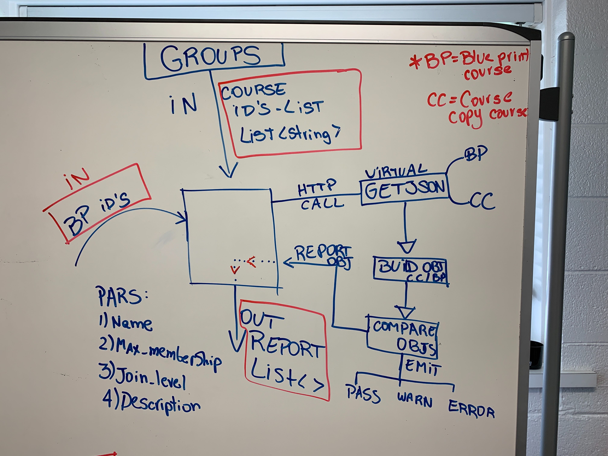

# Key Components Doc for Course Group Audits
#### *Author: Lucas Wargha*
#### *Date: 07/11/2019*

# Preliminary Design

## Magic Box Chart

<!-- Think through the process as much as makes sense, and then create a magic box chart with the whiteboard and place it here. -->

## Explanation of Design
The audit requires the org unit ids for the blueprint course and the course copy. It will compare the two courses to make sure that they are the same as far as the individual groups go. It will be looking at specific properties that will be defined to perform error/warning/success emission. After that, the program will emit failures, successes, and warnings based off of the results recieved from the previous audit components.

### Used Libraries
Canvas API Wrapper

## Things to Consider Before Getting Project Approved
- Are there any approved libraries that I can use? [Link to Approved Library List]
- Are there design patterns that will help?  [Link to Design Patterns]
- Can I design it so that it is a general tool instead of a specific solution?
- How can it be easily expanded?
- What does the minimum viable product look like?

## Prep for Learning Phase
- What do I need to learn
- How will I learn it
- What will I do to learn it (prototypes/tutorials/research time limit?)
- What is the definition of done for my learning process
- How do I measure the progress of learning
- Is there a deliverable that can be created during the learning process?

-----

#### *Preliminary Design Approved By:* 
#### *Preliminary Design Approval Date:*

# Full Design

## Component Diagrams
<!-- Diagrams and companion explanations for all Key Components.
These would include information about inputs, outputs, and what a function does for every major function. -->

<!-- For each component, the following template will be followed: (In other words, the template below will repeat for each component)-->
### INPUTS: 
#Group JSON object:
This holds the same structure as the Canvas Group Categories Object.
https://canvas.instructure.com/doc/api/groups.html

#Data IN => 
- *Status* - Contains a value describing the success of the operation ( 0 = pass, 1 = warning, 2 = failure)
- *Message* - The message accompanying the status of the operation.
- *ListCourseIds* - Contains the list of the course ID's to be audited
- *BluePrintID* - A string (int number) containing the id of the course that the audit will use as to build the compare object.

#Data OUT =>
- *List<AuditMessage> - A list of the audit messages generated in each audit. This list will be nested, because each course has several groups. So most likely, it won't be only one per course being audited.
### METHODS
### *GetJson*
##### Parameters: 

- *BlueprintCourseID*: The ID for the blueprint course.
- *CopiedCourseID* : ID for the copied course ID.

##### Outputs:
List with two POCO objects. 
- *BlueprintCourse*: Object of the groups in the blueprint course.
- *CopiedCourse* : Object containing the groups for the copy course.

### *BuildPocoObjs*
##### Parameters: 

- *BlueprintCourseStg*: The ID for the blueprint course.
- *CopiedCourseStg* : ID for the copied course ID.

##### Outputs:
List with two POCO objects. 
- *BlueprintCourse*: Object of the groups in the blueprint course.
- *CopiedCourse* : Object containing the groups for the copy course.
<!-- For a future release:
## Test Plans
For each major function the test plan template will be as follows (in other words the template below will repeat for each test) 
### *Insert name of component here (e.g. convertIdToCourseObject function)*
#### Test 1: *Insert Test name here*
Summary: 
 *Insert Test Summary Here*
 Type: *Insert Type here (Unit Test, Manual Test, Selenium/Puppeteer test (Overkill?))* 
Procedure:
1. *Insert Steps here*
1. *and here*
1. *and here*
Expected Outcome:
*Insert Expected Outcome here*
-->

## Test Plans

### *Insert Module Name Here*
#### How to Test:

-----

#### *Full Design Approved By:* 
#### *Full Design Approval Date:*

<!-- Diagram Types:
 - Data Flow (I think this will be the most popular)
 - Structure Charts (This is really good for showing input and output of every function)
 - UML Class Diagram (a must for object oriented projects) -->

