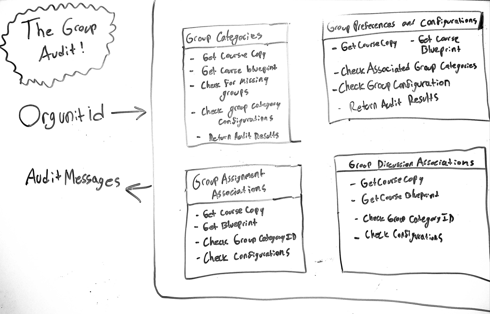

# Key Components Doc for Course Group Audits
#### *Authorz: Lucas Wargha, John Riley, Eric Julander*
#### *Date: 07/11/2019*

# Preliminary Design

## Magic Box Chart

<!-- Think through the process as much as makes sense, and then create a magic box chart with the whiteboard and place it here. -->

## Explanation of Design
This audit is preformed through four sub-audits.
### Group Categoriez Sub Audit
- _Get Course Copy:_  We will start by grabbing the group_categories from the course copy using the following API call.

    /api/v1/courses/:course_id/group_categories
- _Get Course Blueprint:_  We will then grab the group_categories from the course blueprint.
- _Check for Missing Groups:_ This function simply checks if the course copy has the same amout of group categories as the blueprint.

- _Check Groups Category Configurations:_ This function  checks if the configurations for the group category match those of the blueprint. It will check the following attributes of the group_category object.
    - `name`
    - `role`
    - `self_signup`
    - `group_limit`
    - `auto_leader`
    - `context_type`
    - `protected`
    - `allows_multiple_memberships`
    - `is_member`

### Group Configurations and Preferences Audit
- _Get Course Copy:_  We will start by grabbing the groups from the course copy. We will do this by making the following API call.

        GET /api/v1/courses/:course_id/groups

- _Get Course Blueprint:_  We will then grab the groups from the course blueprint.
- _Check Group Category Id:_ Once we have the copy and blueprint groups, we will make sure that the groups are all assoiated to the proper group category. Inorder to properly conduct the audit, we will need to make a call to the following API to get the GroupCategories from the Copy and the Blueprint.

    /api/v1/courses/:course_id/group_categories

- _Check Configurations:_ We will compare the following attributes to those in the blueprint.
    - `name` 
    - `is_public`
    - `followed_by_user`
    - `join_level`
    - `context_type`
    - `permissions`

### Group Assignment Associations
- An API call will be made to the endpoint `/courses/:course_id/blueprint_subscriptions` which returns a blueprint subcription object like the following:  

    `[ { "blueprint_course": { "id": 35764 } } ]`

- The id member value will then be extracted. The following API call will then be made with the course id and course blueprint id: `/courses/:course_id/assignments` .

- The `group_category_id` member of each `assignment` object for the blueprint and course will be compared.  If **both** values are **not null**, then the `group_category` object will be fetched using the following API call: `/courses/:courses_id/group_categories` .

- The following members of the `group_category` object will then be compared:
    - `name`
    - `role`
    - `self_signup`
    - `auto_leader`
    - `group_limit`

### Group Discussion Associations
- An API call will be made to the endpoint `/courses/:course_id/blueprint_subscriptions` which returns a blueprint subcription object like the following:  

    `[ { "blueprint_course": { "id": 35764 } } ]`

- The id member value will then be extracted. The following API call will then be made with the course id and course blueprint id: `/courses/:course_id/discussion_topics` .

- The `group_category_id` member of the `discussion_topic` objects for the blueprint and course will be compared.  If **both** values are **not null**, then the `group_category` object will be fetched using the following API call: `/courses/:course_id/group_categories` .

- The following members of the `group_category` object will then be compared:
    - `name`
    - `role`
    - `self_signup`
    - `auto_leader`
    - `group_limit`

### Used Libraries
Canvas API Wrapper

## Things to Consider Before Getting Project Approved
- Are there any approved libraries that I can use? [Link to Approved Library List]
- Are there design patterns that will help?  [Link to Design Patterns]
- Can I design it so that it is a general tool instead of a specific solution?
- How can it be easily expanded?
- What does the minimum viable product look like?

## Prep for Learning Phase
- What do I need to learn
- How will I learn it
- What will I do to learn it (prototypes/tutorials/research time limit?)
- What is the definition of done for my learning process
- How do I measure the progress of learning
- Is there a deliverable that can be created during the learning process?

-----

#### *Preliminary Design Approved By:* 
#### *Preliminary Design Approval Date:*

# Full Design

## Component Diagrams
<!-- Diagrams and companion explanations for all Key Components.
These would include information about inputs, outputs, and what a function does for every major function. -->

<!-- For each component, the following template will be followed: (In other words, the template below will repeat for each component)-->
### INPUTS: 
- *CourseId* - Contains the list of the course ID's to be audited

#Data OUT =>
- *List<AuditMessage> - A list of the audit messages generated in each audit. 

<!-- For a future release:
## Test Plans
For each major function the test plan template will be as follows (in other words the template below will repeat for each test) 
### *Insert name of component here (e.g. convertIdToCourseObject function)*
#### Test 1: *Insert Test name here*
Summary: 
 *Insert Test Summary Here*
 Type: *Insert Type here (Unit Test, Manual Test, Selenium/Puppeteer test (Overkill?))* 
Procedure:
1. *Insert Steps here*
1. *and here*
1. *and here*
Expected Outcome:
*Insert Expected Outcome here*
-->

## Test Plans

### *Insert Module Name Here*
#### How to Test:

-----

#### *Full Design Approved By:* 
#### *Full Design Approval Date:*

<!-- Diagram Types:
 - Data Flow (I think this will be the most popular)
 - Structure Charts (This is really good for showing input and output of every function)
 - UML Class Diagram (a must for object oriented projects) -->

