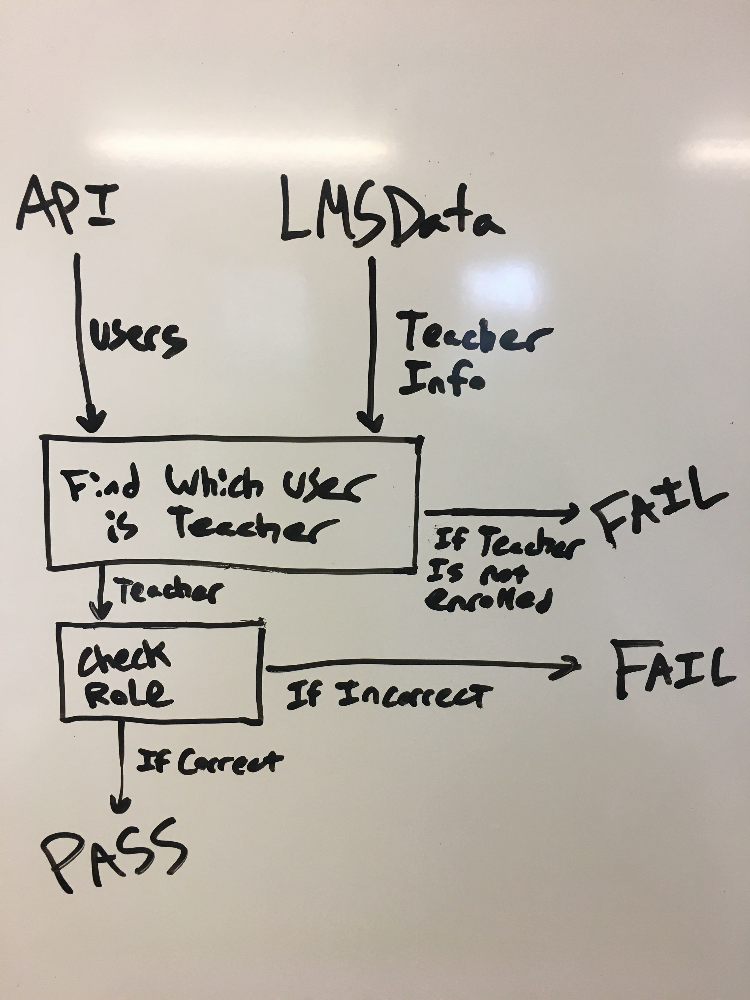

# Key Components Doc for Instructor Enrollments Are Correct
#### *Author: Matt Wyndham, Jake Schwantes*
#### *Date: 07/19/2019*

# Preliminary Design

## Magic Box Chart

## Explanation of Design
The aduit will get the user(s) that are enrolled as online instructors from canvas api using `/api/v1/{course_id:}/users`, and it will also get the correct instructor's information from LMSData. The audit will find the teacher user object that associates with the correct instructor by checking the information given by LMSData. If the instructor is not enrolled, the audit will fail. If the instructor is enrolled, the audit will check the instructor's user object to ensure it has the correcct instructor role. If it is correct, the audit will pass. Otherwise, it will fail.

### Used Libraries
Canvas API Wrapper

<!--## Things to Consider Before Getting Project Approved
- Are there any approved libraries that I can use? [Link to Approved Library List]
- Are there design patterns that will help?  [Link to Design Patterns]
- Can I design it so that it is a general tool instead of a specific solution?
- How can it be easily expanded?
- What does the minimum viable product look like?
## Prep for Learning Phase
- What do I need to learn
- How will I learn it
- What will I do to learn it (prototypes/tutorials/research time limit?)
- What is the definition of done for my learning process
- How do I measure the progress of learning
- Is there a deliverable that can be created during the learning process?
-->

-----

#### *Preliminary Design Approved By:* 
#### *Preliminary Design Approval Date:*

# Full Design

## Component Diagrams
<!-- Diagrams and companion explanations for all Key Components.
These would include information about inputs, outputs, and what a function does for every major function. -->

<!-- For each component, the following template will be followed: (In other words, the template below will repeat for each component)-->

### *Insert Component name here*

Diagram:

*Insert Diagram Here*

Explanation:

*Insert Explanation here*

<!-- For a future release:
## Test Plans
For each major function the test plan template will be as follows (in other words the template below will repeat for each test) 
### *Insert name of component here (e.g. convertIdToCourseObject function)*
#### Test 1: *Insert Test name here*
Summary: 
 *Insert Test Summary Here*
 Type: *Insert Type here (Unit Test, Manual Test, Selenium/Puppeteer test (Overkill?))* 
Procedure:
1. *Insert Steps here*
1. *and here*
1. *and here*
Expected Outcome:
*Insert Expected Outcome here*
-->

## Test Plans

### *Insert Module Name Here*
#### How to Test:

-----

#### *Full Design Approved By:* 
#### *Full Design Approval Date:*

<!-- Diagram Types:
 - Data Flow (I think this will be the most popular)
 - Structure Charts (This is really good for showing input and output of every function)
 - UML Class Diagram (a must for object oriented projects) -->

<!--
"instructor enrollments are correct" and "instructors have correct role" had similar logic. I merged the two audits into one and merged fail conditions as well, putting both project captures and key components into individual files in one folder.
-->
