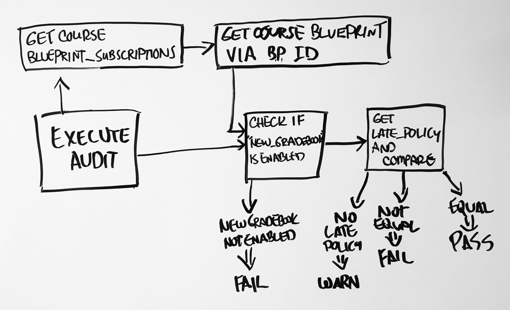

# Key Components Doc for Audit: Late Policy Is Copied Correctly
#### *Author: John Reiley*
#### *Date: July 7, 2019*

# Preliminary Design

## Magic Box Chart

<!-- Think through the process as much as makes sense, and then create a magic box chart with the whiteboard and place it here. -->

## Explanation of Design

1. An API call will be made to the endpoint `/course/:course_id/blueprint_subscriptions` which returns a blueprint subcription object like the following:  

    `[ { "blueprint_course": { "id": 35764 } } ]`

2. The id member value will then be extracted. The following API call will then be made with the course id and course blueprint id: `/course/:course_id/features/enabled`  

    This returns an array of enabled features, which will be used to determine whether or not the "new gradebook" feature is enabled (`[..."new_gradebook",...]`). If not enabled, there is a possibilty that the late policy does not exist and the audit will **fail**.

    A late policy will only exist under the following conditions:   
    * "new gradebook" is or has been previously enabled  
    *  late policy settings have been adjusted

3. If "new gradebook" is enabled, the second API call will get the late policy for the course and its blueprint. The keys of both late policies will then be compared. The audit will **pass** if they are the same.
        
    _Note: If there are no permissions to access the late policy, an **error** message will be given._

### Used Libraries
- HttpClient

<!-- ## Things to Consider Before Getting Project Approved
- Are there any approved libraries that I can use? [Link to Approved Library List]
- Are there design patterns that will help?  [Link to Design Patterns]
- Can I design it so that it is a general tool instead of a specific solution?
- How can it be easily expanded?
- What does the minimum viable product look like?

## Prep for Learning Phase
- What do I need to learn
- How will I learn it
- What will I do to learn it (prototypes/tutorials/research time limit?)
- What is the definition of done for my learning process
- How do I measure the progress of learning
- Is there a deliverable that can be created during the learning process? -->

-----

#### *Preliminary Design Approved By: Jake Schwantes* 
#### *Preliminary Design Approval Date: 19 July 2019*

# Full Design

## Component Diagrams
<!-- Diagrams and companion explanations for all Key Components.
These would include information about inputs, outputs, and what a function does for every major function. -->

<!-- For each component, the following template will be followed: (In other words, the template below will repeat for each component)-->

### *Insert Component name here*

Diagram:

*Insert Diagram Here*

Explanation:

*Insert Explanation here*

<!-- For a future release:
## Test Plans
For each major function the test plan template will be as follows (in other words the template below will repeat for each test) 
### *Insert name of component here (e.g. convertIdToCourseObject function)*
#### Test 1: *Insert Test name here*
Summary: 
 *Insert Test Summary Here*
 Type: *Insert Type here (Unit Test, Manual Test, Selenium/Puppeteer test (Overkill?))* 
Procedure:
1. *Insert Steps here*
1. *and here*
1. *and here*
Expected Outcome:
*Insert Expected Outcome here*
-->

## Test Plans

### *Insert Module Name Here*
#### How to Test:

-----

#### *Full Design Approved By:Jake Schwantes* 
#### *Full Design Approval Date: 23 July 2019*

<!-- Diagram Types:
 - Data Flow (I think this will be the most popular)
 - Structure Charts (This is really good for showing input and output of every function)
 - UML Class Diagram (a must for object oriented projects) -->
