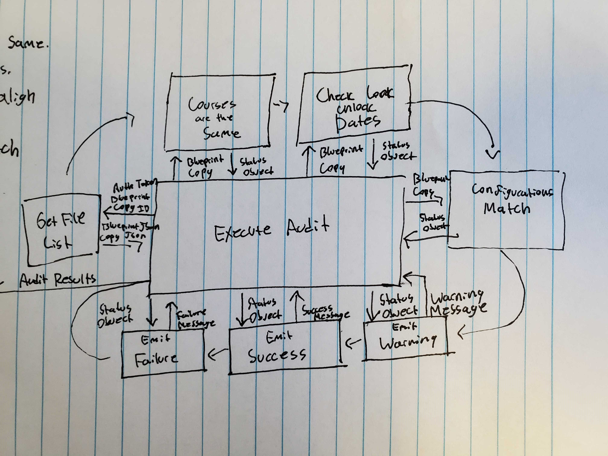

# Key Components Doc for Locked-Files Audit
#### *Author: Eric Julander*
#### *Date: July 10th, 2019*

# Preliminary Design

## Magic Box Chart

<!-- Think through the process as much as makes sense, and then create a magic box chart with the whiteboard and place it here. -->

## Explanation of Design
<!-- Add explanation of the Magic Boxes image above. Answers to the prompts below may also be appropriate to include here. -->
### API Calls:
Blueprint Subscriptions
> GET /api/v1/courses/:course_id/blueprint_subscriptions

Course Files
> GET /api/v1/courses/:course_id/files
### General Flow:
The audit will recieve an org unit id for a course. From there it will make a call to get the org unit for the blueprint course. Once it has the blueprint course Id, it will mkae two calls to the courses and then deserialize the json into individual course file objects. It will then compare both of these objects and check wether they are from the same course, wether associated files have matching lock dates, and that those associated files have matching lock configurations. Once this is all done, the program will then generate errors, warnings, and successes from the results of these various audit functions.

### Used Libraries
None
## Things to Consider Before Getting Project Approved
- Are there any approved libraries that I can use? [Link to Approved Library List]
- Are there design patterns that will help?  [Link to Design Patterns]
- Can I design it so that it is a general tool instead of a specific solution?
- How can it be easily expanded?
- What does the minimum viable product look like?

## Prep for Learning Phase
- What do I need to learn
- How will I learn it
- What will I do to learn it (prototypes/tutorials/research time limit?)
- What is the definition of done for my learning process
- How do I measure the progress of learning
- Is there a deliverable that can be created during the learning process?

-----

#### *Preliminary Design Approved By:* 
#### *Preliminary Design Approval Date:*

# Full Design

### Object Definitions:
<!-- Diagrams and companion explanations for all Key Components.
These would include information about inputs, outputs, and what a function does for every major function. -->

<!-- For each component, the following template will be followed: (In other words, the template below will repeat for each component)-->

## Component Diagrams
#### LockedFile:
This holds the same structure as the Canvas Locked-File Object.
https://canvas.instructure.com/doc/api/group_categories.html
#### Status Object
- *Status* - Contains a value describing the success of the operation ( 0 = pass, 1 = warning, 2 = failure)
- *Message* - The message accompanying the status of the operation.

### Methods:
#### GetFileList
This grabs a LockedFile object from the canvas API.

##### Parameters: 

- *AuthToken*: The API Token for canvas. 
- *OrgId*: The org unit id for the course.

##### Outputs:

- *GroupCategory*: A POCO which holds the data of a Canvas Locked-File Object.

#### CoursesMatch (Courses are the Same)
This checks wethere the two courses are the same. If the courses are completley different, it will emit a "Mismatched Course Failure" though a status object. If the courses are the same it will emit a "success" through the status object.

##### Parameters: 

- *BlueprintCourse*: LockedFileObject for the blueprint course. 
- *CopiedCourse*: LockedFileObject for the copied course.

##### Outputs:

- *StatusObject*: The status of the preformed operation (pass, warning, failure)

#### ContentsMatch (No Files Missing)
 If either the blueprint or the copied course have a file which cannot be found in the other, it will emit a "Missing File Warning" through the status object. 

##### Parameters: 

- *BlueprintCourse*: LockedFileObject for the blueprint course. 
- *CopiedCourse*: LockedFileObject for the copied course.

##### Outputs:

- *StatusObject*: The status of the preformed operation (pass, warning, failure)

#### LockConfigurationsMatch (Configurations are the Same)
This checks that both the blueprint and the copied courses have matching lock configurations for each respective file. If the configurations are not matching, it will emit a "Mismached Configuration Failure" though the status object. If the courses has all matching lock-file configurations, it will emit a success through the status object.

##### Parameters: 

- *BlueprintCourse*: LockedFileObject for the blueprint course. 
- *CopiedCourse*: LockedFileObject for the copied course.

##### Outputs:

- *StatusObject*: The status of the preformed operation (pass, warning, failure)

#### EmitError
This emits an error message to insert into the AuditReport object.

##### Parameters::

- *StatusObject*: A status object to convert into a canvas audit report message.

##### Outputs:

- *AuditReportMessage*: The error message to insert into the final AuditReport
#### EmitWarning
This emits a warning message to insert into the AuditReport object.

##### Parameters::

- *StatusObject*: A status object to convert into a canvas audit report message.

##### Outputs:

- *AuditReportMessage*: The warning message to insert into the final AuditReport
#### EmitSuccess
This emits an success message to insert into the AuditReport object.

##### Parameters:

- *StatusObject*: A status object to convert into a canvas audit report message.

##### Outputs:

- *AuditReportMessage*: The success message to insert into the final AuditReport

<!-- For a future release:
## Test Plans
For each major function the test plan template will be as follows (in other words the template below will repeat for each test) 
### *Insert name of component here (e.g. convertIdToCourseObject function)*
#### Test 1: *Insert Test name here*
Summary: 
 *Insert Test Summary Here*
 Type: *Insert Type here (Unit Test, Manual Test, Selenium/Puppeteer test (Overkill?))* 
Procedure:
1. *Insert Steps here*
1. *and here*
1. *and here*
Expected Outcome:
*Insert Expected Outcome here*
-->

## Test Plans

### GetFileList
#### How to Test:
This will grab the contents of a sandbox course and compare it to an exisiting object of that course. If they match, the test will pass.
### CoursesMatch (Courses are the Same)
#### How to Test:
We will pass in two courses. On course will be an actual copy while the other will be completley different. The Different course should fail and the copy should passs.
### ContentsMatch (No Files Missing)
#### How to Test:
We will pass in two courses which are nearly identical. The only difference will be that one course will have a file that does not exist in the other. If the function works properly, it will emit a warning.
### LockConfigurationsMatch (Configurations are the Same)
#### How to Test:
In this test we will pass in two courses which have matching locked-file configurations and two courses which have conflicting configurations. The former should emit a success while the latter should emit a failure.
### EmitError
#### How to Test:
We will pass in a status object flagged as an error. If it works properly, the function should pass an Auditor Error Message.
### EmitWarning
#### How to Test:
We will pass in a status object flagged as an warning. If it works properly, the function should pass an Auditor Warning Message.
### EmitSuccess
#### How to Test:
We will pass in a status object flagged as an success. If it works properly, the function should pass an Auditor Success Message.

-----

#### *Full Design Approved By:* 
#### *Full Design Approval Date:*

<!-- Diagram Types:
 - Data Flow (I think this will be the most popular)
 - Structure Charts (This is really good for showing input and output of every function)
 - UML Class Diagram (a must for object oriented projects) -->
