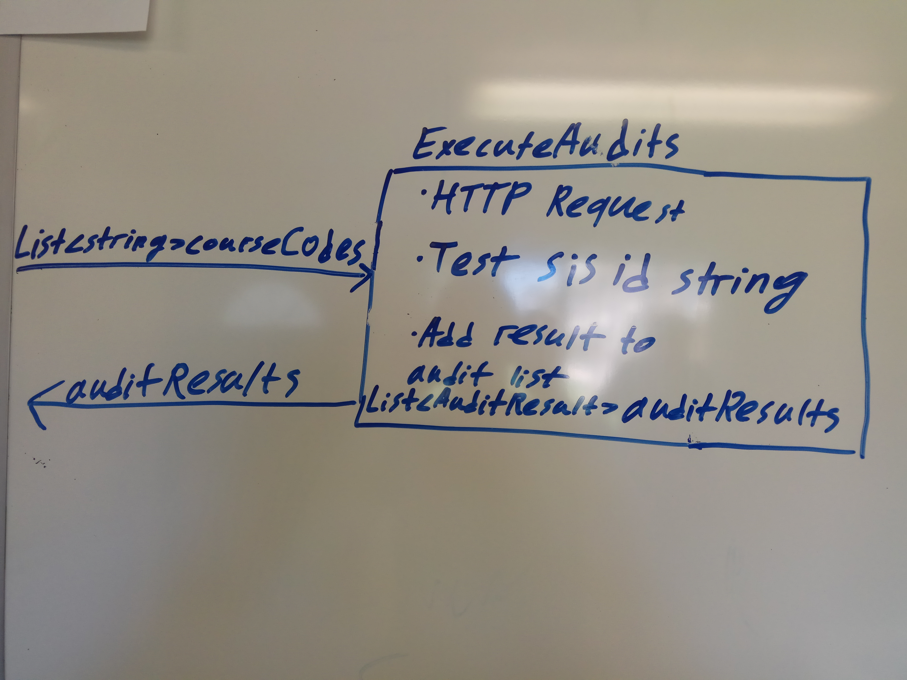

# Key Components Doc for SIS ID Audit
#### *Author: Evgeniy Bekker*
#### *Date: July 11th 2019*

# Preliminary Design

## Magic Box Chart

<!-- Think through the process as much as makes sense, and then create a magic box chart with the whiteboard and place it here. -->

## Explanation of Design
<!-- Add explanation of the Magic Boxes image above. Answers to the prompts below may also be appropriate to include here. -->

This audit will test the SIS ID of a given course. There will be a class SisIdAudit that will inherit from the Audit class.
the ExecuteAudits function will get a course code as a parameter and then will make an API call: https://byui.instructure.com//api/v1/courses/course_id to get
that course. It will test the correctness of the sis_course_id property of that course. For each course it will create a new AuditResult object and add it to a list of AuditResults. Finally, it will return that list of AuditResults.

Testing the SIS ID string:
    "campus/online.YEAR.Semester.ClassCode.duration.instructor_email" 
    ex. "Campus.2019.Fall.FAML 120.Block1.denniss@byui.edu"

    1. Split the SIS ID string into an array of strings with "." as the delimiter.
    2. Check if the first element of the array is equals to "campus" or "online"
    3. Check if the second element contains 4 digits, maybe check if it's 2019 or higher? 
        (brainstorm about how exactly to do this) or check if it's equals to CurrentYear or higher?
    4. Check if the third element equals to "Fall", "Winter", "Spring", or "Summer"
    5. Check the fourth element - Class Code (not sure how to do that or what exactly to check yet)
    6. Check the fifth element - duration. As I understand, it can be either "Block1", "Block2", or "None".
        None means it's a full semester class. 
    7. Check sixth (or sometimes fifth) element - email. The email should be the email of the instructor of the
       course(?) So it should start with his/her username and end with "@byui.edu".

Maybe use the canvas wrapper(if ready by then)

### Used Libraries

## Things to Consider Before Getting Project Approved
- Are there any approved libraries that I can use? [Link to Approved Library List]
- Are there design patterns that will help?  [Link to Design Patterns]
- Can I design it so that it is a general tool instead of a specific solution?
- How can it be easily expanded?
- What does the minimum viable product look like?

## Prep for Learning Phase
- What do I need to learn
- How will I learn it
- What will I do to learn it (prototypes/tutorials/research time limit?)
- What is the definition of done for my learning process
- How do I measure the progress of learning
- Is there a deliverable that can be created during the learning process?

-----

#### *Preliminary Design Approved By: Jake Schwantes* 
#### *Preliminary Design Approval Date: 31 July 2019*

# Full Design

## Component Diagrams
<!-- Diagrams and companion explanations for all Key Components.
These would include information about inputs, outputs, and what a function does for every major function. -->

<!-- For each component, the following template will be followed: (In other words, the template below will repeat for each component)-->

### *Insert Component name here*

Diagram:

*Insert Diagram Here*

Explanation:

*Insert Explanation here*

<!-- For a future release:
## Test Plans
For each major function the test plan template will be as follows (in other words the template below will repeat for each test) 
### *Insert name of component here (e.g. convertIdToCourseObject function)*
#### Test 1: *Insert Test name here*
Summary: 
 *Insert Test Summary Here*
 Type: *Insert Type here (Unit Test, Manual Test, Selenium/Puppeteer test (Overkill?))* 
Procedure:
1. *Insert Steps here*
1. *and here*
1. *and here*
Expected Outcome:
*Insert Expected Outcome here*
-->

## Test Plans

### *Insert Module Name Here*
#### How to Test:

-----

#### *Full Design Approved By:* 
#### *Full Design Approval Date:*

<!-- Diagram Types:
 - Data Flow (I think this will be the most popular)
 - Structure Charts (This is really good for showing input and output of every function)
 - UML Class Diagram (a must for object oriented projects) -->

